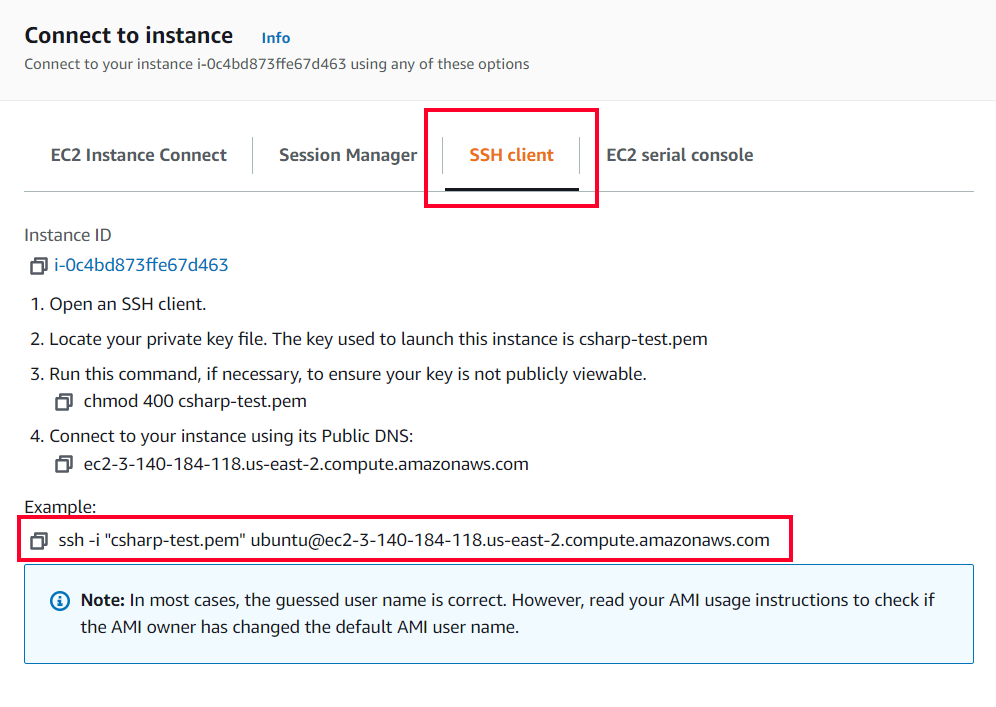

# AWS_Deployment_Ins
General Instruction for Deploying <b><i>personal project</i></b> on AWS.

## Launch EC2 Instance


## Ubuntu Server Version (Will change in future)


## General Network Setting
Create a key


Network setting


## SSH Into Instance




## What to do next
We want to install nginx
```bash
$ sudo apt install nginx -y
```
From here what we need to install is based on what we are using for our project
<ul>
  <li>Using MySQL as our backend</li>
  
  ```bash
  $ sudo apt install mysql-server -y
  $ sudo mysql
  ```
  ```bash
  mysql> ALTER USER 'root'@'localhost' IDENTIFIED WITH mysql_native_password BY 'root';
  mysql> FLUSH PRIVILEGES;
  mysql> exit;
  ```
  ```bash
  $ sudo mysql_secure_installation
  ```
  
  <li>Using Python install Gunicorn</li>
  
  ```bash
  # Navigate to Project folder
  $ sudo vim wsgi.py  # This will open the new, empty
  ```
  ```py
  from server import app as application
  if __name__ == "__main__":
      application.run()
  ```
  ```bash
  $ gunicorn --bind 0.0.0.0:5000 wsgi:application # We need to direct Gunicorn to our project's wsgi.py file, which is the entry point to our application.
  [2016-12-27 05:45:56 +0000] [8695] [INFO] Starting gunicorn 19.6.0
  [2016-12-27 05:45:56 +0000] [8695] [INFO] Listening at: http://0.0.0.0:5000 (8695)
  [2016-12-27 05:45:56 +0000] [8695] [INFO] Using worker: sync
  [2016-12-27 05:45:56 +0000] [8700] [INFO] Booting worker with pid: 8700
  $ sudo vim /etc/systemd/system/gunicorn.service
  ```
  ```bash
  [Unit]
  Description=Gunicorn instance
  After=network.target
  [Service]
  User=ubuntu
  Group=www-data
  WorkingDirectory=/home/ubuntu/{{repo name}}
  Environment="PATH=/home/ubuntu/{{repo name}}/venv/bin"
  ExecStart=/home/ubuntu/{{repo name}}/venv/bin/gunicorn --workers 3 --bind unix:{{project}}.sock -m 007 wsgi:application
  [Install]
  WantedBy=multi-user.target
  ```
  ```bash
  $ sudo systemctl start gunicorn
  $ sudo systemctl enable gunicorn
  # A <ProjectName>.sock will be generated in Project Folder
  ```
  
  <li>Using Node</li>
  
  ```bash
  $ nodejs -v
  # this should print out version 10.19.0
  $ curl -sL https://deb.nodesource.com/setup_lts.x -o nodesource_setup.sh
  $ sudo bash nodesource_setup.sh
  $ sudo apt install nodejs -y
  $ node -v
  # this should now print out version 14.7.0 or newer
  $ sudo apt install build-essential
  # We want move our client-side build to /var/www/html
  $ cd ~/$repoName/client
  $ sudo rm -rf /var/www/html 
  $ sudo mv build /var/www/html
  $ sudo service nginx restart
  $ sudo npm i pm2 -g
  $ pm2 start server.js # Navigate To Server ofc
  ```
  
  <li>Using .NET MVC</li>
  
  ```bash
  $ wget https://packages.microsoft.com/config/ubuntu/20.04/packages-microsoft-prod.deb -O packages-microsoft-prod.deb
  $ sudo dpkg -i packages-microsoft-prod.deb
  $ sudo apt-get install apt-transport-https
  $ sudo apt-get install -y dotnet-sdk-<version>
  $ dotnet tool install dotnet-ef --global
  # We want to clone our project at /var/www
  ```
  
  <li>Using Supervisor for .NET</li>
  
  ```bash
  $ sudo apt install supervisor -y
  $ dotnet publish # Navigate to Project folder in /var/www ofc
  $ cd /etc/supervisor/conf.d
  $ sudo vim <projectname>.conf
  ```
  ```bash
  [program:<yourAppname>]
  command=/usr/bin/dotnet  /var/www/<yourReponame>/bin/Debug/net<version>/publish/<yourAppname>.dll
  directory=/var/www/<yourReponame>/bin/Debug/net<version>/publish
  autostart=true
  autorestart=true
  stderr_logfile=/var/log/<yourAppname>.err.log
  stdout_logfile=/var/log/<yourAppname>.out.log
  environment=ASPNETCORE_ENVIRONMENT=<Production|Development>,ASPNETCORE_URLS="http://*:<route in LaunchSetting>/"
  user=www-data
  stopsignal=INT
  ```
  
</ul>

## Nginx config
<ul>
  <li>For Flask Python</li>
  
  ```bash
  $ sudo vim /etc/nginx/sites-available/{{project}}
  ```
  ```bash
  server {
      listen 80;
      server_name {{your public ip}};
      location / {
          include proxy_params;
          proxy_pass http://unix:/home/ubuntu/{{repo name}}/{{project}}.sock;
      }
  }
  ```
  ```bash
  $ sudo ln -s /etc/nginx/sites-available/{{project}} /etc/nginx/sites-enabled
  ```
  <li>For MERN and .NET</li>
  
  ```bash
  $ sudo rm /etc/nginx/sites-available/default
  $ sudo vim /etc/nginx/sites-available/default
  ```
  ```bash
  # .NET deployment
  server {    
      listen 80;    
      location / {        
          proxy_pass http://localhost:5000[replace 5000 with your port from launchsettings.json];        
          proxy_http_version 1.1;        
          proxy_set_header Upgrade $http_upgrade;        
          proxy_set_header Connection keep-alive;        
          proxy_set_header Host $host;        
          proxy_cache_bypass $http_upgrade;    
      }
  }
  ```
  ```bash
  # MERN-Deployment Configuration 1-16-2020
  server {
      listen 80 default_server;
      listen [::]:80 default_server;
      root /var/www/html;
      index index.html index.htm index.nginx-debian.html;
      server_name MERN-Deployment;
      location /api {
          proxy_pass http://localhost:8000;
          proxy_http_version 1.1;
          proxy_set_header Upgrade $http_upgrade;
          proxy_set_header Connection 'upgrade';
          proxy_set_header Host $host;
          proxy_cache_bypass $http_upgrade;    
      }
      location / {
          try_files $uri $uri/ =404;
      }
      error_page 404 /index.html;
  }
  ```
</ul>

After done with Config
```bash
$ sudo nginx -t # should receive OK
$ sudo rm /etc/nginx/sites-enabled/default # Only for Flask Python since we are using socket
$ sudo service nginx restart
```
